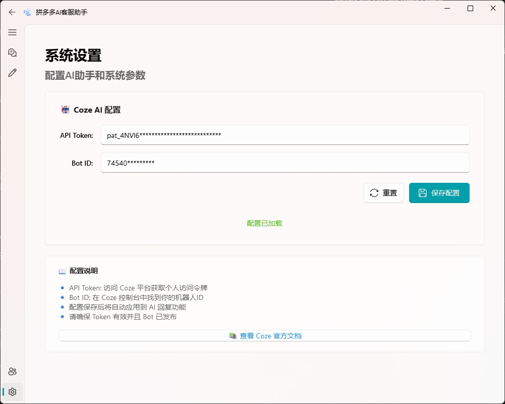
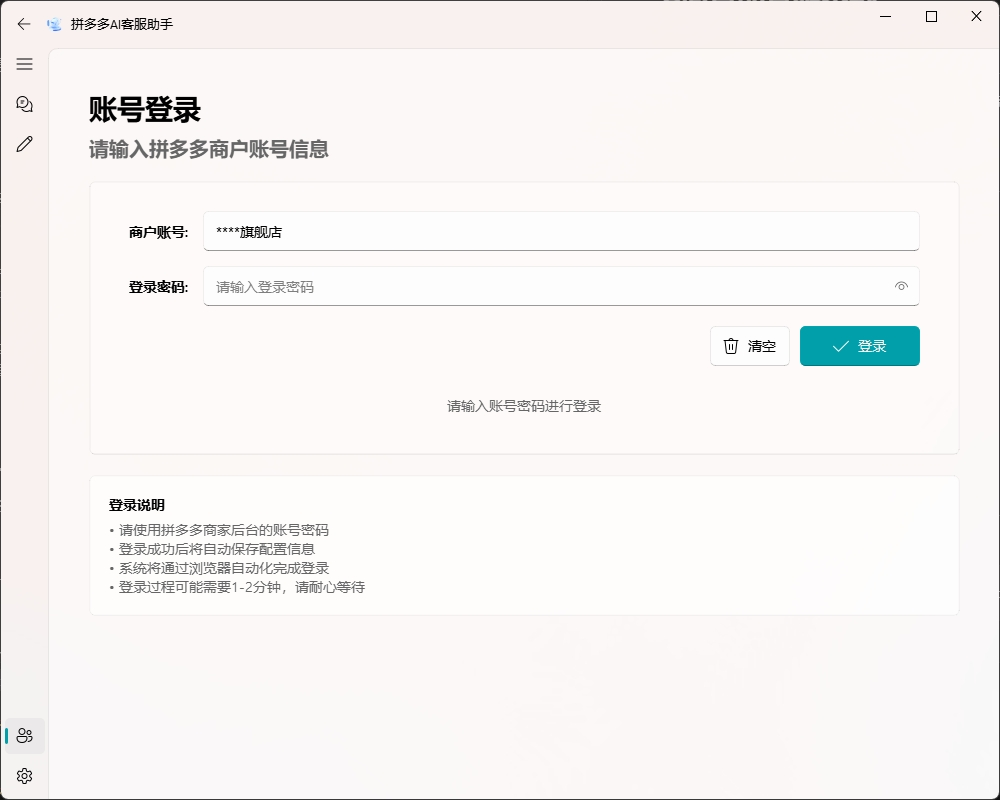
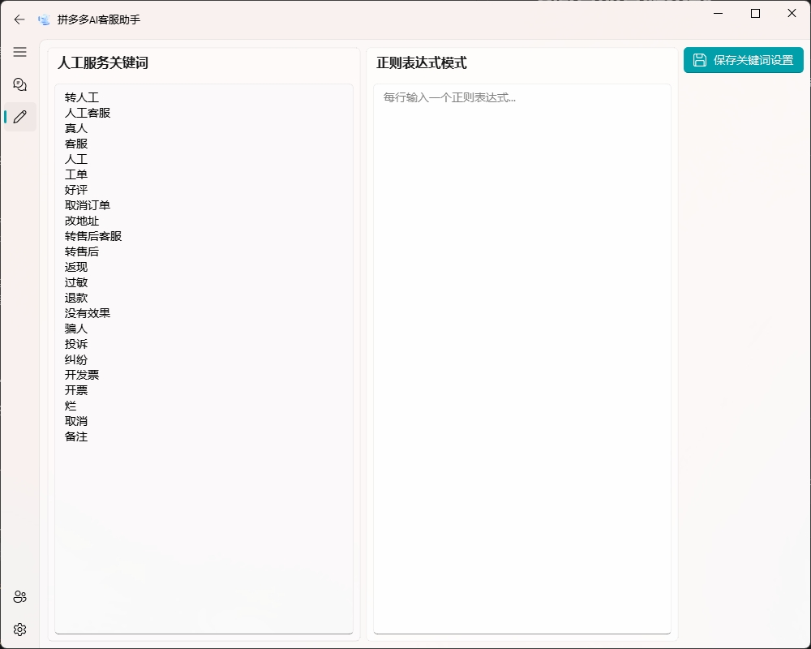
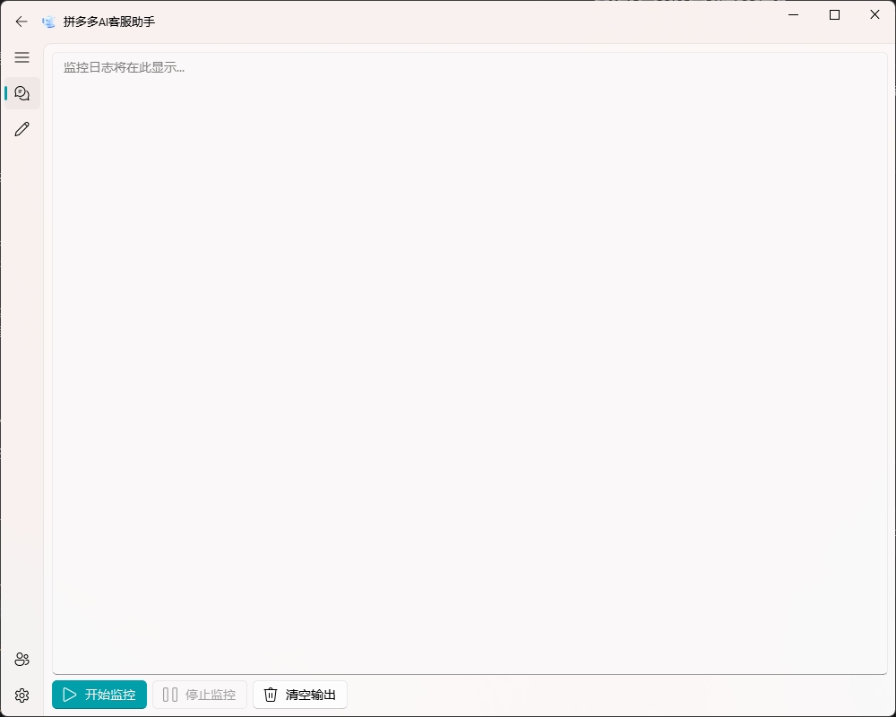

# 🤖 拼多多智能客服系统

<div align="center">
  
  <p><em>拼多多智能客服系统 - 提升客服效率的智能化解决方案</em></p>
</div>

## 📖 项目简介

拼多多智能客服系统是一个专为电商平台设计的综合性客户服务管理工具。本系统通过AI技术和自动化流程，显著提高客服工作效率，实现智能回复的同时保留人工介入的灵活性，为商家提供完整的客服解决方案。

## ✨ 主要功能

### 🔐 账号管理
- 单商家账号管理
- 自动登录获取cookies
- 账号状态实时监控

<div align="center">
  
  <p><em>账号管理 - 管理您的拼多多商家账号</em></p>
</div>

### 💬 智能消息处理
- 实时消息监控与自动回复
- 集成AI (Coze API) 生成智能回复内容
- 支持自定义回复模板和关键词识别

### 🔄 智能转接系统
- 基于关键词智能识别客户需求
- 自动将复杂问题转接给人工客服
- 无缝衔接确保服务质量

<div align="center">
  
  <p><em>关键词管理 - 智能识别转接需求</em></p>
</div>

### 📊 系统监控
- 实时日志记录
- 系统运行状态监控
- 详细的操作记录和统计

<div align="center">
  
  <p><em>日志界面 - 实时监控系统运行状态</em></p>
</div>

## 🚀 快速开始

### 环境要求
- Python 3.8+
- Windows 10/11 (推荐)
- 网络连接稳定

### 安装步骤

1. **克隆项目**
   ```bash
   git clone https://github.com/JC0v0/Customer-Agent.git
   cd Customer-Agent
   ```

2. **安装依赖**
   ```bash
   ##使用uv进行环境配置
   ##安装uv
   pip install uv

   uv venv
   uv sync
   ```

3. **安装浏览器驱动**
   ```bash
   playwright install chrome
   ```

4. **配置API密钥**
   
   在 `config/config.json` 文件中设置您的 Coze API 配置：
   ```bash
   cp config-template.json config.json
   ```      

   ```json
   {
       "coze_token": "pat_4NVl6fHb7290nP********",
       "coze_bot_id": "74540****"
   }
   ```

## 📱 使用指南

### 启动系统
```bash
python main.py
```
或者直接运行：
```bash
./拼多多AI客服.bat
```

### 配置流程

1. **配置商家账号**
   - 在账号管理界面配置您的拼多多商家账号
   - 系统将自动获取并保存登录凭证

2. **设置关键词规则**
   - 配置需要人工转接的关键词
   - 设置自动回复的话术模板

3. **启动监控**
   - 开始实时监控客户消息
   - 系统将根据配置自动处理消息

## 🛠️ 技术架构

- **前端界面**: qfluentwidgets
- **后端逻辑**: Python
- **AI集成**: Coze API
- **数据存储**: SQLite + JSON
- **浏览器自动化**: Playwright

## 📁 项目结构

```
Customer-Agent/
├── AI/                 # AI相关模块
├── PDD/                # 拼多多平台接口
├── config/             # 配置文件
├── docs/               # 文档和截图
├── gui/                # 图形界面
├── utils/              # 工具函数
├── main.py             # 主程序入口
└── requirements.txt    # 依赖清单
```

## 🤝 贡献指南

我们欢迎所有形式的贡献！如果您想参与项目开发：

1. Fork 本仓库
2. 创建您的特性分支 (`git checkout -b feature/AmazingFeature`)
3. 提交您的更改 (`git commit -m 'Add some AmazingFeature'`)
4. 推送到分支 (`git push origin feature/AmazingFeature`)
5. 开启一个 Pull Request

## 📄 许可证

本项目采用 MIT 许可证 - 详情请见 [LICENSE](LICENSE) 文件。

## 📞 联系我们

- **问题反馈**: [GitHub Issues](https://github.com/JC0v0/PDD-customer-bot/issues)
- **功能建议**: 欢迎通过 Issues 提出您的想法
- **技术交流**: 点击链接加入腾讯频道【Customer-Agent】：https://pd.qq.com/s/45wvtz4g6?b=5

---

<div align="center">
  <p>⭐ 如果这个项目对您有帮助，请给我们一个星标！</p>
  <p>Made with ❤️ by <a href="https://github.com/JC0v0">JC0v0</a></p>
</div>
